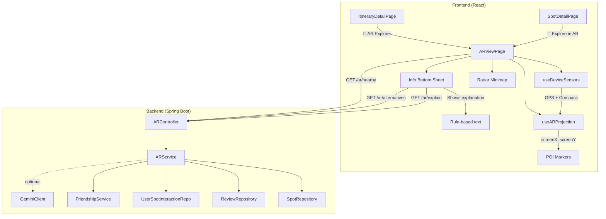

# AR Explorer — Augmented Reality for Itineraries

## Background

The app has a rich itinerary system with multi-day support, stop scheduling, travel time estimation, spot details (reviews, tags, photos, vibe tags), and itinerary generation. This feature adds an **AR camera view** that users activate while following their itinerary to see nearby spots overlaid on the real world, get explanations of spots they're visiting, and receive alternative suggestions.

---

## Decisions (Resolved)

| Decision | Resolution |
|:---|:---|
| AR Approach | **Lightweight camera overlay** (getUserMedia + DeviceOrientation + Geolocation + HTML/CSS). No WebXR/Three.js. Works on iOS + Android. |
| Alternative suggestions | **Both** — category-match preferred, other nearby types shown below |
| AR button placement | **ItineraryDetailPage** (primary) + **SpotDetailPage** (secondary "Explore nearby in AR") |
| Explanations | **Rule-based primary** — assembled from reviews, vibe tags, spot metadata. LLM (Gemini) as **optional enhancement** behind a config flag, off by default. Minimizes AI usage. |
| Gemini API key | ✅ Placeholder added to `.env` |

---

## Proposed Changes

### Phase 1: AR Camera Foundation + POI Markers

The core — a full-screen camera overlay with floating markers for itinerary stops and nearby spots.

```
┌──────────────────────────────────┐
│  [← Back]   AR Explorer  [⚙️]   │  ← Top bar (semi-transparent)
│                                  │
│  <video> — live camera feed      │  ← getUserMedia, rear camera
│                                  │
│   ┌──────┐       ┌──────┐       │  ← POI markers (HTML divs)
│   │ #1 ☕ │       │ #3 🎨 │       │     positioned via bearing calc
│   │120m  │       │ 80m  │       │
│   └──────┘       └──────┘       │
│                                  │
│         ┌──────────┐             │  ← Radar minimap (corner)
│         │  · ◉ ·   │             │
│         │    ·     │             │
│         └──────────┘             │
│                                  │
│  ┌─────────────────────────────┐ │  ← Bottom sheet (slides up on tap)
│  │ ☕ Sukhumvit Café — 120m    │ │
│  │ ⭐ 4.2 · "Cozy hidden gem" │ │
│  │ Known for: Matcha lattes,   │ │
│  │ outdoor seating with city   │ │
│  │ views. Locals love the...   │ │
│  │ [📍 Directions] [🔀 Alts]  │ │
│  └─────────────────────────────┘ │
└──────────────────────────────────┘
```

---

#### [NEW] `frontend/src/hooks/useDeviceSensors.js`

Custom hook encapsulating all device sensor access:

```js
const {
  position,          // { latitude, longitude, accuracy }
  heading,           // compass heading 0-360° (smoothed)
  tilt,              // device pitch (beta)
  isSupported,       // boolean — device has required sensors
  hasPermission,     // boolean — permissions granted
  requestPermission, // async fn — triggers iOS permission dialog
  error              // string | null
} = useDeviceSensors()
```

**Implementation details:**
- GPS via `navigator.geolocation.watchPosition` (high accuracy, 2s interval)
- Compass via `deviceorientation` event with low-pass filter (α=0.3) for smoothing
- iOS `DeviceOrientationEvent.requestPermission()` handling
- Fallback detection: if no compass, show "Compass unavailable" and disable directional markers (still show radar minimap with distance-only mode)

---

#### [NEW] `frontend/src/hooks/useARProjection.js`

Pure math hook — converts POI GPS coordinates to screen positions:

```js
const projectedPOIs = useARProjection({
  userLat, userLng, heading, tilt,
  pois,               // [{ lat, lng, id, name, type, ... }]
  cameraFOV: 60,      // degrees
  maxDistance: 500     // meters
})
// Returns: [{ ...poi, screenX, screenY, distance, bearing, isVisible }]
```

**Core math:**
- Bearing: `atan2(sin(Δlng)·cos(lat2), cos(lat1)·sin(lat2) - sin(lat1)·cos(lat2)·cos(Δlng))`
- Distance: Haversine formula (already exists in codebase — reuse from ItineraryDetailPage)
- Screen projection: `angleDiff = bearing - heading` → `screenX = (angleDiff / FOV) × width + width/2`
- Vertical offset: inverse distance scaling + tilt compensation

---

#### [NEW] `frontend/src/pages/ARViewPage.jsx`

Main AR page. Key sections:

1. **Camera layer** — `<video>` element fullscreen, rear camera
2. **Markers layer** — Absolutely positioned divs for each visible POI, using existing `iconMap` from ItineraryDetailPage for category icons
3. **Radar minimap** — Small circular overlay in bottom-right showing all POIs as dots relative to user heading
4. **Bottom info sheet** — Slides up on marker tap, shows spot details + rule-based explanation + action buttons
5. **Top controls** — Back button, settings (range slider for max distance)
6. **Permission gate** — Shown first time, requesting camera + GPS + orientation access
7. **Desktop fallback** — "Open on your phone" card with a link to the same URL

**State management:**
```
- cameraStream (MediaStream)
- selectedPOI (the tapped marker)
- showInfoSheet (boolean)
- nearbySpots (fetched from API)
- itineraryStops (from route param)
- explanation (rule-based text for selected spot)
- alternatives (same-category nearby spots)
- maxRange (user-adjustable, default 500m)
```

---

#### [NEW] `frontend/src/pages/ARViewPage.css`

Immersive full-screen styling:
- Video fills viewport (`object-fit: cover`)
- POI markers: glassmorphism cards with backdrop-blur, category icon, distance label, pulse animation for nearest stop
- Bottom sheet: slide-up with `transform` transition, drag handle
- Radar: circular with semi-transparent dark background, heading wedge indicator, color-coded dots (same palette as map markers)
- Smooth transitions for markers entering/leaving viewport
- Safe area insets for notched phones

---

#### [MODIFY] `frontend/src/App.jsx`

Add route:
```jsx
import ARViewPage from './pages/ARViewPage'
// ...
<Route path="/ar/:itineraryId" element={<ProtectedRoute><ARViewPage /></ProtectedRoute>} />
```

---

#### [MODIFY] `frontend/src/pages/ItineraryDetailPage.jsx`

Add "🔮 AR Explorer" button in the owner actions section (line ~862 area, after the Export PDF row):
```jsx
<div style={{ display: 'flex', gap: '0.5rem' }}>
  <Link to={`/ar/${id}`} className="btn-edit" style={{ flex: 1, ... }}>
    🔮 AR Explorer
  </Link>
</div>
```

---

#### [MODIFY] `frontend/src/pages/SpotDetailPage.jsx`

Add a secondary "Explore nearby in AR" button in the spot actions area (below "Directions" button, line ~454):
```jsx
<button className="btn btn-ghost" onClick={() => navigate(`/ar/spot/${spot.id}`)}>
  🔮 Explore in AR
</button>
```
This uses a variant route `/ar/spot/:spotId` that loads the AR view centered on a single spot rather than an itinerary.

---

### Phase 2: Backend API + Nearby Discovery + Alternatives

---

#### [NEW] `src/.../controller/ARController.java`

REST controller:

```
GET /api/v1/ar/nearby?lat={}&lng={}&radiusM={500}&excludeIds={1,2,3}
→ Returns spots within radius, excluding specified IDs, ordered by rank score, limit 20

GET /api/v1/ar/alternatives?spotId={}&lat={}&lng={}&radiusM={500}
→ Returns spots of same category first, then other categories, near the location
→ Excludes the specified spot. Returns max 10.

GET /api/v1/ar/explain?spotId={}&userId={}
→ Returns rule-based explanation assembled from spot metadata + reviews + vibe tags
→ If GEMINI_API_KEY is configured AND gemini.enabled=true, enhances with LLM (optional)
```

---

#### [NEW] `src/.../service/ARService.java`

Service layer:

```java
public class ARService {

    // Nearby spot discovery
    List<SpotDTO> findNearbySpots(double lat, double lng, int radiusMeters, List<Long> excludeIds)

    // Alternative suggestions (same category first, then others)
    List<SpotDTO> findAlternatives(Long spotId, double lat, double lng, int radiusMeters)

    // Rule-based explanation (primary — no AI)
    SpotExplanation buildExplanation(Long spotId, Long userId) {
        // 1. Load spot: name, type, address, tags, vibe tags
        // 2. Load top 5 reviews (expert-first)
        // 3. Extract key phrases from reviews matching vibe keywords
        // 4. Assemble structured explanation:
        //    - "Known for:" line from tags + top vibe tags
        //    - "What people say:" curated review excerpts
        //    - "Tip:" contextual tip based on spot type
        //    - "Your friends say:" if any friend reviewed this spot
    }
}
```

**Rule-based explanation template by spot type:**

| Type | Template |
|:---|:---|
| Café | "Known for: {top vibe tags}. Reviewers highlight: {best review excerpt}. Tip: Best visited in the {morning/afternoon}." |
| Restaurant | "Cuisine highlights: {tags}. {expert review excerpt}. Average meal: {cost estimate from reviews}." |
| Artwork/Museum | "About this spot: {tags + description}. Visitors say: {review excerpts}. Tip: Spend ~{duration} minutes here." |
| Viewpoint | "What you'll see: {review excerpts about views}. Best time: {morning/sunset if mentioned}. Tip: Bring a camera!" |
| Market | "What to find: {tags}. Locals recommend: {review excerpts}. Tip: Visit early for the best selection." |
| Default | "{type} in {area}. {vibe tags}. Visitors say: {top review excerpt}." |

This approach:
- ✅ **Zero AI cost** — uses only existing data
- ✅ **Instant response** — no LLM latency
- ✅ **Personalized** — includes friend reviews and user's vibe preferences
- ✅ **Degrades gracefully** — even if a spot has no reviews, it still shows tags/type info

---

#### [NEW] `src/.../dto/SpotExplanation.java`

```java
public record SpotExplanation(
    Long spotId,
    String spotName,
    String headline,        // "Cozy café · Hidden gem"
    String knownFor,        // "Matcha lattes, outdoor seating"
    String whatPeopleSay,   // Curated review excerpts
    String tip,             // Contextual tip
    String friendSays,      // null if no friend reviewed
    boolean aiEnhanced      // false for rule-based, true if Gemini was used
) {}
```

---

#### [OPTIONAL] `src/.../service/GeminiClient.java`

Only activated when `GEMINI_API_KEY` is set to a real key AND a config flag is enabled. Wraps the Gemini API for enhanced explanations. **Off by default.**

```java
@Service
@ConditionalOnProperty(name = "gemini.enabled", havingValue = "true", matchIfMissing = false)
public class GeminiClient {
    // Called by ARService.buildExplanation() only when available
    // Enhances the rule-based explanation with richer prose
    // Caches results for 1 hour to minimize API calls
}
```

Add to `.env`:
```
GEMINI_ENABLED=false
```

This way the LLM is completely dormant unless explicitly enabled. The rule-based system is the full experience.

---

### Phase 3: Polish & Progressive Enhancement

---

#### Desktop Fallback (inside ARViewPage.jsx)

When `isSupported` is false (no camera/sensors):
```jsx
<div className="ar-desktop-fallback">
  <div className="glass">
    <h2>📱 AR Explorer</h2>
    <p>Open this page on your phone to explore spots in augmented reality.</p>
    <p className="ar-url">{window.location.href}</p>
    <button onClick={copyLink}>📋 Copy Link</button>
  </div>
</div>
```

---

#### Radar Minimap (inside ARViewPage.jsx)

A `<canvas>` element (150×150px) rendered inline:
- Dark semi-transparent circle
- User at center with heading wedge
- POIs as colored dots (reusing type → color mapping)
- Distance rings at 100m, 250m, 500m
- Tapping a dot on the radar selects that POI

---

#### Spot-Only AR Mode

Route: `/ar/spot/:spotId` — loads AR view centered on a single spot:
- Shows that spot + nearby spots within 500m
- No itinerary timeline context
- Used from SpotDetailPage's "Explore in AR" button

---

## Architecture



---

## File Summary

| Phase | File | Type | Description |
|:---:|:---|:---:|:---|
| 1 | `frontend/src/hooks/useDeviceSensors.js` | NEW | GPS, compass, orientation hook |
| 1 | `frontend/src/hooks/useARProjection.js` | NEW | Bearing/distance → screen projection |
| 1 | `frontend/src/pages/ARViewPage.jsx` | NEW | Main AR camera view (~400 lines) |
| 1 | `frontend/src/pages/ARViewPage.css` | NEW | Full-screen immersive styling |
| 1 | `frontend/src/App.jsx` | MODIFY | Add `/ar/:itineraryId` and `/ar/spot/:spotId` routes |
| 1 | `frontend/src/pages/ItineraryDetailPage.jsx` | MODIFY | Add AR Explorer button |
| 1 | `frontend/src/pages/SpotDetailPage.jsx` | MODIFY | Add "Explore in AR" button |
| 2 | `src/.../controller/ARController.java` | NEW | 3 REST endpoints |
| 2 | `src/.../service/ARService.java` | NEW | Nearby, alternatives, explanations |
| 2 | `src/.../dto/SpotExplanation.java` | NEW | Explanation response DTO |
| 2 | `src/.../service/GeminiClient.java` | NEW | Optional LLM client (off by default) |
| 2 | `.env` | MODIFY | ✅ Done — Gemini placeholder added |

---

## Verification Plan

### Automated Tests
- Unit tests for `useARProjection` bearing/distance math
- Unit tests for `ARService.buildExplanation()` with mock spot + review data
- Unit tests for `ARService.findAlternatives()` category matching logic

### Manual Verification
- Physical phone test: camera feed + POI markers tracking with rotation
- iOS Safari: DeviceOrientationEvent permission flow
- Android Chrome: full AR experience
- Desktop: fallback card displayed (no crash)
- No GPS: graceful error message
- Spot with no reviews: explanation still shows type + tags info
- Spot with expert reviews: explanation highlights expert quotes
- Alternative suggestions: same-category results appear first

---

## Implementation Order

I'll build this in the following sequence:

1. **`useDeviceSensors.js`** — sensor access foundation
2. **`useARProjection.js`** — math layer
3. **`ARViewPage.jsx` + `.css`** — the AR UI (camera, markers, radar, info sheet)
4. **Route wiring** — App.jsx + buttons in ItineraryDetailPage + SpotDetailPage
5. **`ARController.java` + `ARService.java`** — backend API
6. **`SpotExplanation.java`** — DTO
7. **`GeminiClient.java`** — optional, dormant by default
8. **Testing & polish**
